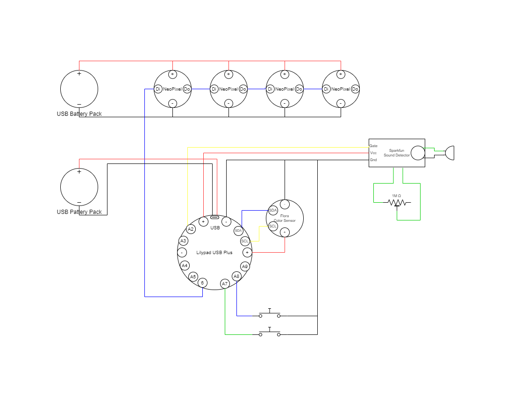

# Robe Noel PHI 2022

## Features
- Light blinking with music beat
- Light color change with color sensor
- 3 modes (off, beat, steady on)

## Material
- [Lilypad USB Plus](https://www.sparkfun.com/products/14631)
- [4 X Adafruit RGB Neopixel v2](https://www.adafruit.com/product/1260)
- Side leaking 6mm fiber optic cable
- [Adafruit Flora Color Sensor](https://www.adafruit.com/product/1356)
- [SparkFun Sound Detector](https://www.sparkfun.com/products/12642)
- Old wired headset with mic
- 22 AWG stranded wires
- Dupont connectors
- JST connectors
- 2 X USB Battery pack
- 2 X USB wires
- 1M Ohms potentiometer

## Diagram

## Result
- 